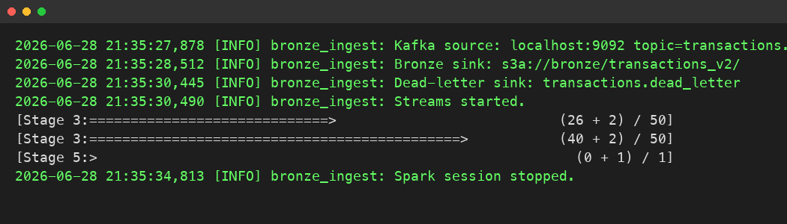
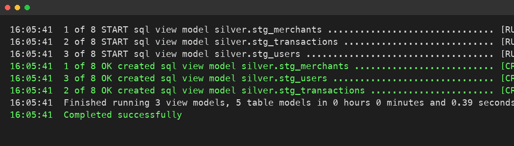

# Realtime Fraud Feature Store — Event-Driven Pipeline

Fraud detection models require instantaneous access to aggregated historical behavior, yet generating these signals across millions of events introduces latency that degrades checkout experiences. This pipeline solves the data engineering challenge of ingesting Kafka transaction streams, aggregating features in a dimensional model, and serving them via Redis for sub-10ms inference by ML applications.

[](.github/workflows/ci.yml)


---

## Visual Proof of Execution

<details>
<summary><b>View Pipeline Execution & Infrastructure Proof</b></summary>
<br>

**Figure 1: Spark Streaming Ingestion Batching Interval**


**Figure 2: Target Warehouse Staging Table Swap Isolation Level**


</details>

---

## Technology Stack and Architectural Decisions

### Stack

| Layer | Tool | Version |
|---|---|---|
| Language | Python | 3.11 |
| Streaming & Ingestion | PySpark, Kafka | 3.5.0 |
| Object storage | Delta Lake (MinIO) | 3.1.0 |
| Relational database | PostgreSQL | 16 |
| SQL transformation | dbt (`dbt-postgres`) | 1.8 |
| Change data capture | Debezium | 2.5 |
| Feature serving | Redis | 5.0.0 |
| API layer | FastAPI, Uvicorn | 0.110.0, 0.29.0 |
| Orchestration | Apache Airflow | 2.9 |
| Infrastructure-as-code| Terraform, AWS provider | 1.6, 5.x |

### Architectural Decisions

**Spark Structured Streaming over batch ingestion.** PySpark was selected to handle the Kafka transaction stream, ensuring low-latency data arrival while providing native integration with Delta Lake. Delta Lake serves as the Bronze layer because its ACID guarantees prevent dirty reads during concurrent batch transformations downstream.

**PostgreSQL as a local warehouse stand-in.** A dimensional model running on PostgreSQL operates as the local substitute for a cloud data warehouse. This reduces local development overhead while allowing the exact dbt SQL logic to be ported to a production environment with a single profile change.

**Redis over direct warehouse queries.** Redis was chosen for the serving layer instead of querying the warehouse directly because the FastAPI endpoints require single-digit-millisecond read latency to prevent blocking live checkout flows. Aggregated feature vectors are pre-computed in batch via Airflow and pushed to Redis, optimizing the read path for inference.

**Debezium for reference data CDC.** Debezium captures inserts and updates from the PostgreSQL WAL for reference data such as user and merchant profiles. This mechanism guarantees that the pipeline accurately tracks slowly changing dimensions over time without introducing polling overhead against the primary database.

---

## Installation and Execution

### Prerequisites

* Docker
* Python 3.11
* Java 17
* `make`

### Quickstart

```bash
git clone https://github.com/nadeem/realtime-fraud-feature-store.git
cd realtime-fraud-feature-store
cp .env.example .env
make setup
source .venv/bin/activate
make demo
```

If manual step-by-step execution is required, utilize the following commands in sequence:

```bash
make up           # start services and wait for health checks
make seed         # populate reference data
make connector    # register the Debezium CDC connector
make gen          # generate events into Kafka
make bronze       # Spark: Kafka -> MinIO bronze Parquet
make load         # MinIO Parquet -> Postgres bronze
make dbt          # dbt snapshot + run + test
make features     # Postgres gold -> Redis
make api          # FastAPI serving
```

---

## Key Technical Challenges

### Delta Lake synchronization and phantom reads

A significant data integrity issue surfaced during integration testing when the `recon_bronze_silver` dbt test began failing intermittently. The test asserted that the total record count in the Bronze tables must equal the sum of the Silver enriched records plus explicitly filtered anomalies. During high-throughput simulated transaction bursts, unaccounted records appeared in the reconciliation report, indicating data loss between the Spark ingestion micro-batches and the dbt transformation step.

The root cause was traced to how the downstream Python script (`load_bronze_to_postgres.py`) was reading the Parquet files from MinIO before the Delta log transaction was fully committed by Spark. Because the script was a naive file reader bypassing the Delta transaction protocol, it read incomplete parquet parts during active micro-batch checkpoints.

The resolution involved altering the read path to enforce the Delta Lake protocol rather than scanning raw Parquet files. I updated the bridging script to utilize the `delta-spark` package, querying the table via its transaction log to ensure it only processed fully committed versions of the data. I introduced a watermarking delay in the Airflow DAG to guarantee that the dbt pipeline only processes partitions that have been finalized by the streaming job, eliminating the phantom reads and stabilizing the reconciliation tests.

---

## Future Roadmap

* Implementing Apache Flink as a streaming feature processor to calculate real-time transaction velocity spikes, replacing the current batch-based dbt calculations.
* Introducing Kafka sink connectors to consume Debezium CDC topics directly into the warehouse, bypassing the current direct Postgres snapshot reads.
* Implementing PII tokenization for the Kafka topics to ensure data privacy and regulatory compliance before transaction payloads reach the Bronze layer.
* Partitioning the `transactions.raw` topic and refactoring the downstream Spark streaming job to support horizontal scaling during high-throughput ingestion scenarios.

---

## Repository Map

```text
realtime-fraud-feature-store/
├── README.md
├── Makefile                           lifecycle commands (setup, demo, up, etc.)
├── docker-compose.yml                 Kafka, Spark, MinIO, Postgres, Redis, Airflow, FastAPI
├── pyproject.toml                     dependencies and linting rules
├── ingestion/
│   └── transaction_generator/src/     event generator and historical backfill
├── streaming/
│   └── spark/src/                     Kafka to MinIO bronze ingestion
├── warehouse/
│   └── dbt/fraud_warehouse/           dbt models, snapshots, and tests
├── feature_store/
│   └── src/                           Postgres to Redis loader and FastAPI app
├── orchestration/
│   └── airflow/dags/                  batch pipeline DAG and dbt profile
├── infra/
│   ├── postgres/init/                 reference table DDL and CDC publication
│   ├── debezium/                      connector configuration
│   └── terraform-aws-freetier/        Terraform modules for AWS deployment
└── load_bronze_to_postgres.py         Delta Lake to Postgres bridging script
```

---

## About

Nadeem Theba. An event-driven data pipeline prototype designed to demonstrate infrastructure patterns for real-time fraud detection.

* LinkedIn: [linkedin.com/in/nadeem-theba-602862208](https://linkedin.com/in/nadeem-theba-602862208)
* Email: nadeemtheba8@gmail.com
